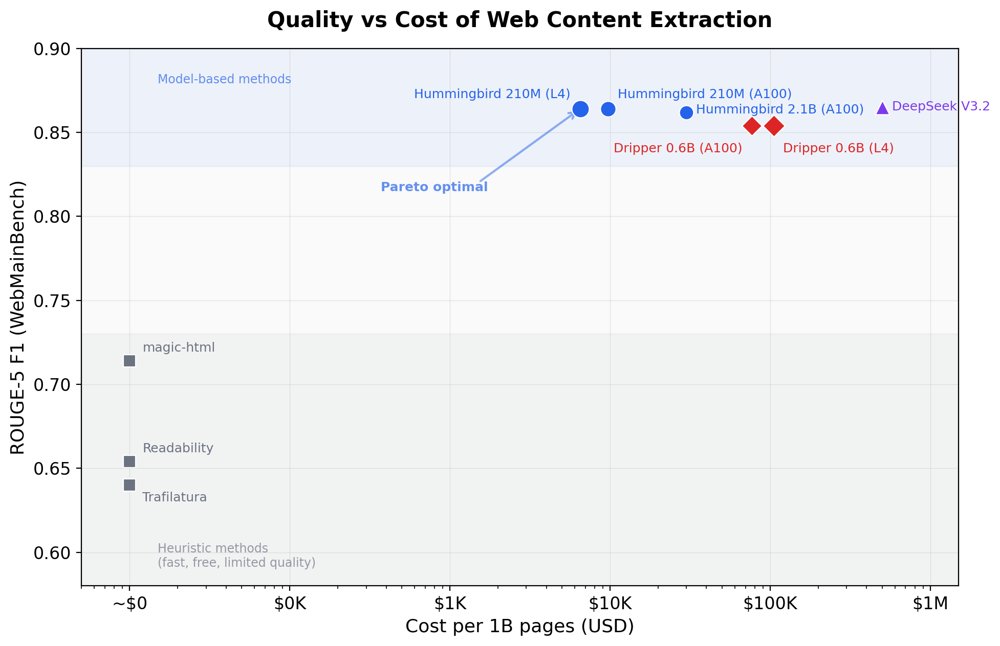
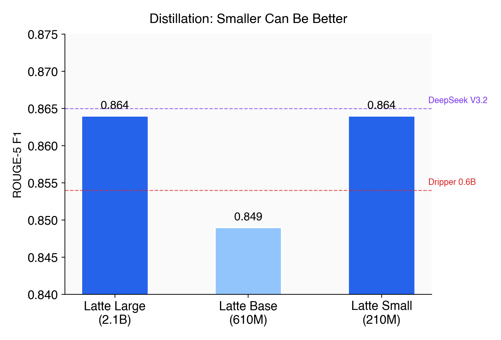
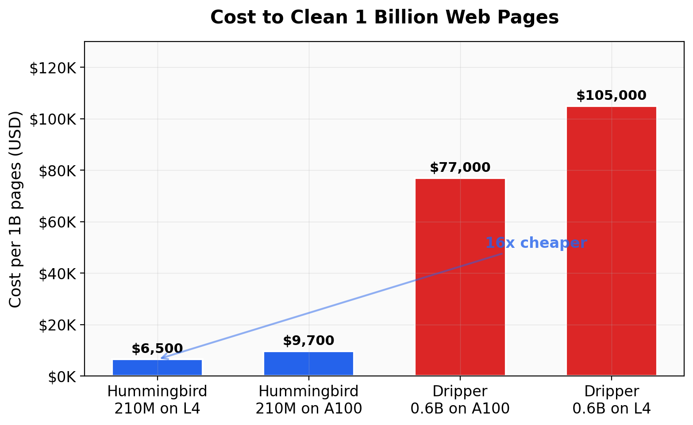
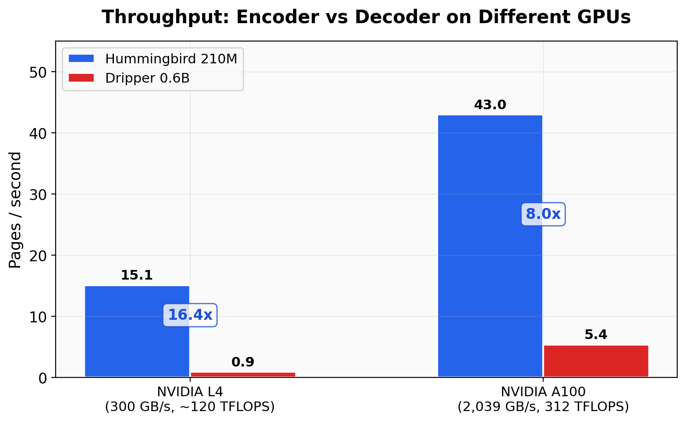

# Introducing Pulpie: Pareto-Optimal Models for Cleaning the Web

Every major open training corpus — C4 (Raffel et al., 2020), RefinedWeb (Penedo et al., 2023), FineWeb (Penedo et al., 2024), Dolma (Soldaini et al., 2024), DCLM (Li et al., 2024) — treats HTML-to-text extraction as a solved problem. Run Trafilatura, move on to the interesting stuff: filtering, deduplication, data mixing. But it isn't solved. The AICC paper (Ma et al., 2025) showed that simply switching from Trafilatura to a model-based extractor, with identical downstream processing, improved LLM benchmark accuracy by 1.08pp across 13 tasks. Extraction quality is as impactful as aggressive filtering — and almost nobody is working on it.

A typical HTML page is 60-70% navigation, ads, cookie banners, sidebars, and footers. Heuristic tools like Trafilatura and Readability work on easy pages and fall apart on complex ones. LLM-based approaches like Dripper get much better quality, but at a cost that makes web-scale processing impractical.

We built Pulpie to close this gap: a family of encoder models that match LLM-level extraction quality at a fraction of the cost. The smallest model (210M parameters, 433MB) runs at 15 pages/sec on a $0.35/hr L4 GPU. Cleaning 1 billion pages costs about $6,500. The equivalent job with Dripper costs $105,000 on the same hardware.

This post covers how we got there.

## The landscape

Content extraction methods fall into three categories, each with a different quality-cost tradeoff (see Bevendorff et al., 2023 for a comprehensive comparison).

**Heuristic extractors** — Trafilatura (Barbaresi, 2021), Readability (Mozilla, based on Arc90), jusText (Pomikálek, 2011), magic-html — use hand-written rules to strip boilerplate. They look for semantic tags (`<article>`, `<main>`), DOM structure, and text density signals. They're fast, free, and require no GPU. But they have no notion of context. A navigation table and a data table look the same to a rule that just counts `<td>` tags.

**LLM-based classifiers** — Dripper (MinerU-HTML, 2025) takes a different approach. It simplifies the HTML, assigns an `_item_id` to each block, then prompts a fine-tuned 0.6B autoregressive model to label each block as "main" or "other." This works well — the model sees the full page and can use context to decide. But it generates tokens sequentially, one at a time, bounded by memory bandwidth rather than compute.

**Feature-based classifiers** — tools like boilerpipe (Kohlschütter et al., 2010) and our own GBM approach extract structural features (link density, DOM depth, position) and train a classifier on them. These are fast but cap out at the same ceiling as heuristics. Thirty numeric features encode roughly the same signals that Readability hard-codes in XPaths. Without reading the actual text, a feature-based model can't distinguish a content table from a navigation table.

The following table shows where each method lands on WebMainBench, a benchmark of 7,809 annotated web pages (Ma et al., 2025). We report ROUGE-5 F1 on the full English subset (6,647 pages):

| Method | Type | All | Simple | Mid | Hard | Empty |
|--------|------|-----|--------|-----|------|-------|
| **Pulpie Orange Large** | **Encoder (2.1B)** | **0.873** | **0.914** | **0.878** | **0.827** | **21** |
| Dripper | Decoder (0.6B) | 0.864 | 0.914 | 0.865 | 0.818 | 135 |
| **Pulpie Orange Base** | **Encoder (610M)** | **0.863** | **0.906** | **0.868** | **0.818** | **36** |
| **Pulpie Orange Small** | **Encoder (210M)** | **0.862** | **0.906** | **0.868** | **0.813** | **45** |
| magic-html | Heuristic | 0.700 | 0.773 | 0.697 | 0.637 | 384 |
| Raw html2text | Baseline | 0.620 | 0.779 | 0.605 | 0.491 | 0 |
| Trafilatura | Heuristic | 0.619 | 0.721 | 0.619 | 0.526 | 16 |

All three Pulpie models outperform Dripper on the full benchmark. The 210M model scores 0.862 — matching a 0.6B autoregressive model while being 3x smaller. The 2.1B teacher leads overall at 0.873, with the largest gains on Mid (+1.3pp) and Hard (+0.9pp) pages where context matters most. "Empty" counts pages where the method produced no output (context overflow for Dripper, no blocks detected for Pulpie).



## Why encoders?

Content extraction is a classification problem, not a generation problem. Each block on the page gets a binary label: keep or discard. There's no need to produce new text.

Dripper solves this by generating a sequence of labels autoregressively — `1main2other3main...` — one token at a time. This means the model is bottlenecked by memory bandwidth (how fast you can read the KV cache), not by compute (how many FLOPs you can do). High-bandwidth GPUs like the A100 (2 TB/s) handle this reasonably well. Cheap GPUs like the L4 (300 GB/s) do not.

An encoder processes the entire page in a single forward pass. All blocks are classified simultaneously. The workload is compute-bound — it scales with FLOPS, not memory bandwidth. This has two practical consequences:

1. **Encoders are fast on any GPU.** The 210M Pulpie model runs at 15 pages/sec on an L4, 43 pages/sec on an A100. Dripper runs at 0.92 pages/sec on the same L4, 5.4 on the same A100. The gap is 16x on cheap hardware, 8x on expensive hardware.

2. **Encoders get cheaper as GPUs get cheaper.** L4s have bad memory bandwidth but decent FLOPS per dollar. For bandwidth-bound workloads (autoregressive decoding), L4s are a poor choice. For compute-bound workloads (encoder inference), they're ideal. Pulpie on L4 costs $6,500 per billion pages. Dripper on A100 costs $77,000. Dripper on L4 costs $105,000 — it's actually *more* expensive on cheaper hardware because the bandwidth bottleneck dominates.

## Architecture

Pulpie's pipeline has four stages:

```
raw HTML → simplify_html → tokenize + chunk → encoder classify → reconstruct
```

**1. Simplify HTML (CPU).** We use MinerU-HTML's `simplify_html` to strip scripts, styles, and formatting noise from raw HTML. Each block element gets a unique `_item_id` attribute. This is the same preprocessing Dripper uses, so we're on equal footing.

**2. Tokenize and chunk (CPU).** The simplified HTML is split into blocks at `_item_id` boundaries. Blocks are tokenized, then packed into chunks separated by a special `<|sep|>` token:

```
[BOS] block_1_html <|sep|> block_2_html <|sep|> ... block_N_html <|sep|> [EOS]
```

Each chunk fits within the model's context window (8,192 tokens). Most pages (80%) fit in a single chunk. The `<|sep|>` token after each block is the classification position for that block.

**3. Encoder classify (GPU).** A single forward pass through the encoder. The model outputs a binary logit at each `<|sep|>` position: main content or boilerplate. Bidirectional attention means every block sees every other block on the page — the model can use page-level context to make decisions.

**4. Reconstruct.** Blocks classified as "main" are extracted from the original simplified HTML and converted to markdown (or kept as HTML for downstream processing).

The key difference from Dripper: steps 1 and 4 are identical. Steps 2 and 3 replace autoregressive generation with a single encoder forward pass. The quality comes from the same input representation. The speed comes from the architecture.

## Training

### Labels: teaching with DeepSeek V3.2

No human-annotated block-level labels exist at the scale we need. So we built them.

We sampled 16,670 English pages from Common Crawl (CC-MAIN-2026-12, one per unique domain). For each page, we ran the MinerU-HTML pipeline with DeepSeek V3.2 as the labeling model. DeepSeek receives the simplified HTML and classifies each block as main or other.

We tested five prompt variants. The `short_compact` prompt scored highest at 0.865 ROUGE-5 on WebMainBench — this became our labeling configuration.

After filtering (removing tiny pages, near-empty pages, and pages where the model's output was truncated), we had 15,880 pages with 1.23M labeled blocks. A quality audit (20 random pages scored by LLM sub-agents) showed 85% good or acceptable labels. The main systematic error was article titles and bylines labeled as "other" — consistent and low-impact.

We cross-validated with Dripper 0.6B on all 15,880 pages. Block-level agreement was 93.3%. We kept only blocks where both models agreed, giving us high-confidence training labels.

Total labeling cost: $129 on Bedrock. About 5 hours of compute.

### Teacher: EuroBERT-2.1B

We fine-tuned EuroBERT-2.1B (Boizard et al., 2025) on the agreed labels from 14,959 CC pages. EuroBERT is a RoPE-based encoder with bidirectional attention — structurally similar to a decoder-only transformer but without causal masking. It supports 8,192-token contexts out of the box.

Training details: learning rate 2e-5, batch size 4 with gradient accumulation 2, class-weighted cross-entropy (main weight 1.748, other weight 0.700 to handle the 28.6% main-content class rate), gradient checkpointing, 4× A100.

The teacher reached 0.873 ROUGE-5 on the full 6,647-page English WebMainBench subset. This *exceeds* the DeepSeek V3.2 labels it was trained on (0.840 with the v0 prompt used during labeling). The encoder, by seeing the full page bidirectionally, learned patterns the autoregressive labeler missed.

### Distillation: 2.1B → 210M

We distilled the 2.1B teacher into two smaller students: a 610M (Orange Base) and a 210M (Orange Small).

Following Hinton et al. (2015), distillation used KL divergence loss (α=0.7) combined with hard-label cross-entropy (α=0.3), temperature 2.0, same data. Each distillation took about 2 hours on 4× A100.

The results were surprising:

| Model | Parameters | ROUGE-5 | vs Teacher |
|-------|-----------|---------|------------|
| Orange Large (teacher) | 2.1B | 0.873 | — |
| Orange Base | 610M | 0.863 | -1.0pp |
| **Orange Small** | **210M** | **0.862** | **-1.1pp** |



Both distilled models retain nearly all of the teacher's quality — within 1pp on the full 6,647-page benchmark. The 210M model at 0.862 matches Dripper (0.864) while being 3x smaller and significantly faster. The practical implication is clear: the 210M model offers the best quality-per-FLOP and is the one to use at scale.

## Results

### Quality

On the full English subset of WebMainBench (6,647 pages, all difficulty levels):

| Method | Size | All | Simple | Mid | Hard | P | R |
|--------|------|-----|--------|-----|------|---|---|
| Pulpie Orange Large | 2.1B | 0.873 | 0.914 | 0.878 | 0.827 | 0.865 | 0.917 |
| Dripper | 0.6B | 0.864 | 0.914 | 0.865 | 0.818 | 0.860 | 0.901 |
| Pulpie Orange Base | 610M | 0.863 | 0.906 | 0.868 | 0.818 | 0.858 | 0.906 |
| Pulpie Orange Small | 210M | 0.862 | 0.906 | 0.868 | 0.813 | 0.854 | 0.910 |
| magic-html | — | 0.700 | 0.773 | 0.697 | 0.637 | 0.778 | 0.704 |
| Trafilatura | — | 0.619 | 0.721 | 0.619 | 0.526 | 0.688 | 0.610 |

Pulpie Orange Large leads at 0.873, outperforming Dripper by 0.9pp overall. The gap widens on Mid (+1.3pp) and Hard (+0.9pp) pages where bidirectional context helps most. The 210M model matches Dripper (0.862 vs 0.864) while being 3x smaller.

All Pulpie models have higher recall than Dripper (0.906-0.917 vs 0.901), meaning they extract more of the actual content. Dripper's 135 empty pages (context overflow) versus Pulpie Large's 21 show another practical advantage of the encoder approach — no context length limit issues.

### Speed

All measurements on the same NVIDIA L4 GPU (23GB, $0.35/hr on RunPod), using 500 real Common Crawl pages (median 40KB HTML):

| Model | Architecture | Pages/sec | ms/page |
|-------|-------------|-----------|---------|
| Pulpie 210M | Encoder (SDPA) | 15.1 | 66 |
| Dripper 0.6B | Decoder (vLLM) | 0.92 | 1,087 |
| **Ratio** | | **16.4x** | |

The pipeline breakdown for Pulpie (sequential, single GPU):

| Stage | Time | % |
|-------|------|---|
| simplify_html (CPU) | 13.1s | 24% |
| tokenize + chunk (CPU) | 5.8s | 11% |
| GPU inference | 33.2s | 65% |

GPU is the bottleneck at 65% of wall time, but the model only uses 433MB VRAM — multiple instances can share a single GPU, and CPU preprocessing can be parallelized across cores.

### Cost

| Setup | Pages/sec | GPU-hours / 1B | Cost / 1B pages |
|-------|-----------|---------------|----------------|
| **Pulpie on L4** | **15.1** | **18,400** | **$6,500** |
| Pulpie on A100 | 43 | 6,460 | $9,700 |
| Dripper on A100 | 5.38 | 51,600 | $77,000 |
| Dripper on L4 | 0.92 | 301,000 | $105,000 |





## The economics of encoders vs decoders

The 16.4x throughput gap on L4 deserves explanation. It's not just about parameter count — Dripper is 0.6B, Pulpie is 0.2B, that's only 3x.

The gap is architectural. Autoregressive decoding generates tokens one at a time. Each token requires reading the full KV cache from GPU memory. This makes throughput proportional to memory bandwidth:

- A100: 2,039 GB/s → Dripper at 5.38 pps
- L4: 300 GB/s → Dripper at 0.92 pps (17% of A100 — matches the bandwidth ratio)

Encoder inference runs a single forward pass over the entire input. This is a dense matmul workload that scales with FLOPS:

- A100: 312 TFLOPS → Pulpie at 43 pps
- L4: ~120 TFLOPS → Pulpie at 15.1 pps (35% of A100 — tracks the FLOPS ratio)

The practical consequence: as GPUs get cheaper, encoders benefit more. L4s cost ~4x less per hour than A100s. Dripper loses more throughput than it gains in savings. Pulpie comes out ahead.

At web scale (billions of pages), this is the difference between a $6,500 job and a $105,000 job.

## Models

| Name | HuggingFace | Parameters | ROUGE-5 | Notes |
|------|-------------|-----------|---------|-------|
| Orange Large | `chonkie-ai/pulpie-orange-large-v1` | 2.1B | 0.873 | Teacher model |
| Orange Base | `chonkie-ai/pulpie-orange-base-v1` | 610M | 0.863 | Distilled from Large |
| **Orange Small** | **`chonkie-ai/pulpie-orange-small-v1`** | **210M** | **0.862** | **Recommended** |

All models are built on EuroBERT (Boizard et al., 2025) and use the same `<|sep|>` block-marker architecture. They share a tokenizer and are interchangeable in the pipeline.

Orange Small is the recommended model. It matches the teacher at 1/10th the size, fits in 433MB VRAM, and runs on any GPU (L4, T4, RTX 3090, or even integrated graphics for small batches).

## Get started

The Pulpie models are available on HuggingFace. To start cleaning web pages:

```bash
pip install pulpie
```

```python
from pulpie import extract

markdown = extract(html)
```

If you're processing web data at scale — building training corpora, running RAG pipelines over live pages, or cleaning Common Crawl snapshots — and want to talk about how Pulpie fits into your stack, reach out. We're at [chonkie.ai](https://chonkie.ai), [@chonabordi](https://twitter.com/chonabordi) on Twitter, or come find us on [Discord](https://discord.gg/chonkie).

## Acknowledgements

Pulpie builds directly on the work of the MinerU-HTML and Dripper team (Ma et al., 2025). Their `simplify_html` preprocessing, block-level annotation scheme, and the WebMainBench benchmark are foundational to everything in this post. We also use their Dripper 0.6B model for cross-validating our training labels. Open science makes work like this possible — we're grateful they released their tools and data.

## References

[1] Ma et al. "AICC: Parse HTML Finer, Make Models Better — A 7.3T AI-Ready Corpus Built by a Model-Based HTML Parser." arXiv preprint arXiv:2511.16397 (2025).

[2] Boizard et al. "EuroBERT: Scaling Multilingual Encoders for European Languages." arXiv preprint arXiv:2503.05500 (2025).

[3] Hinton et al. "Distilling the Knowledge in a Neural Network." arXiv preprint arXiv:1503.02531 (2015).

[4] Raffel et al. "Exploring the Limits of Transfer Learning with a Unified Text-to-Text Transformer." JMLR 2020.

[5] Penedo et al. "The RefinedWeb Dataset for Falcon LLM: Outperforming Curated Corpora with Web Data Only." NeurIPS 2023.

[6] Penedo et al. "The FineWeb Datasets: Decanting the Web for the Finest Text Data at Scale." arXiv preprint arXiv:2406.17557 (2024).

[7] Li et al. "DataComp-LM: In Search of the Next Generation of Training Sets for Language Models." NeurIPS 2024.

[8] Soldaini et al. "Dolma: An Open Corpus of Three Trillion Tokens for Language Model Pretraining Research." ACL 2024.

[9] Barbaresi. "Trafilatura: A Web Scraping Library and Command-Line Tool for Text Discovery and Extraction." ACL/IJCNLP 2021.

[10] Kohlschütter et al. "Boilerplate Detection using Shallow Text Features." WSDM 2010.

[11] Pomikálek. "Removing Boilerplate and Duplicate Content from Web Corpora." PhD thesis, Masaryk University, 2011.

[12] Bevendorff et al. "An Empirical Comparison of Web Content Extraction Algorithms." SIGIR 2023.
